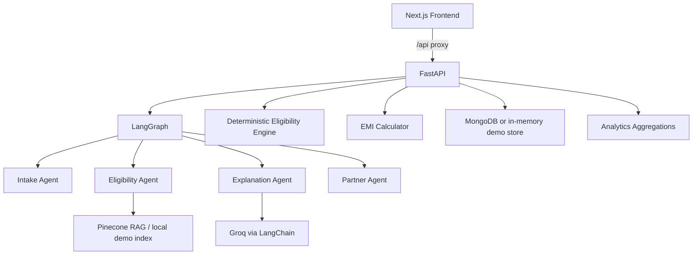

# NidhiSetu — AI-Powered Government Scheme Discovery Platform

**NidhiSetu** (“bridge for financial assistance”) is an AI-assisted, RAG-grounded
government scheme discovery and application-assistance platform. It helps
beneficiaries discover suitable concessional government-backed loan/education
schemes, understand their eligibility, calculate EMI, find authorized
channelizing partners, simulate “what-if” scenarios, and track applications.

> ⚠️ **Legal / safety positioning:** NidhiSetu is an educational/demo platform.
> It never claims “the AI approves your loan” — it reports **“potentially
> eligible”** based on *configured* scheme criteria. Final approval belongs to
> the relevant government agency, bank, or authorized institution. All scheme
> data shipped with this repo is clearly labelled **DEMO / PLACEHOLDER** data
> and must be verified against the latest official guidelines before applying.

---

## 1. Project Overview

Beneficiaries struggle to navigate fragmented government schemes: unclear
eligibility, opaque income caps, confusing EMI math, and no visibility into
where to apply or what happens next. NidhiSetu turns that into a guided
pipeline:

```
USER PROFILE → SKILL/REQUIREMENT INTAKE → DETERMINISTIC ELIGIBILITY ENGINE
→ RAG EVIDENCE RETRIEVAL → MULTI-AGENT ANALYSIS → SCHEME COMPARISON
→ BEST-MATCH RECOMMENDATION → EMI CALCULATION → WHAT-IF SIMULATOR
→ AUTHORIZED PARTNER MATCHING → APPLICATION READINESS → APPLICATION TRACKING
→ ANALYTICS DASHBOARD
```

The system answers: *“Given my category, income, purpose, project/education
cost and profile, which schemes may suit me, why, what evidence supports the
recommendation, what will my EMI approximately be, where can I apply, and what
should I do next?”*

## 2. Problem Statement

- Scheme documents are fragmented across ministries and state agencies.
- Eligibility rules (income caps, age windows, project-cost limits) are hard
  to compare and easy to misread.
- Beneficiaries cannot predict EMI or simulate changes (cost, income, age).
- No single view of “am I ready to apply, and where?”

## 3. Solution

A typed, tested platform where **deterministic services** own every financial
and policy calculation, **RAG** provides evidence, and a **LangGraph
multi-agent layer** interprets intent and narrates results — with graceful
fallbacks so the demo never breaks when external services are offline.

## 4. Key Features

- Data-driven eligibility rules (6 beneficiary categories → many schemes;
  scheme ↔ category many-to-many; income caps configurable per scheme).
- Deterministic eligibility engine with 4 statuses (`eligible`,
  `potentially_eligible`, `not_eligible`, `insufficient_information`),
  boundary-safe comparisons, near-threshold detection and transparent checks.
- Pure EMI mathematics with three documented moratorium policies.
- Authorized partner matching — NPA-flagged and inactive partners are never
  recommended.
- LangGraph multi-agent pipeline: Intake → Flow routing (education/business) →
  Eligibility → Explanation → Partner matching, with conversation memory for
  follow-up questions.
- RAG citations from Pinecone (when configured) or a deterministic local demo
  index; stable chunk IDs; idempotent re-ingestion via admin endpoint.
- Google OAuth 2.0 + explicit demo login; JWT sessions; admin role checks.
- Application persistence & tracking with a deterministic status state machine
  and a timeline UI.
- Deterministic **Application Readiness Score** with a transparent breakdown.
- **What-If Simulator** (sliders over income/cost/age) backed by the rule
  engine — never by an LLM.
- Analytics dashboards (personal + admin) with Recharts.
- Structured error contract, request-ID logging, request size limits, CORS.

## 5. Architecture



### 5.1 Deterministic world vs AI world (the core interview concept)

> **“NidhiSetu does not allow an LLM to make financial calculations or override
> eligibility rules. Deterministic services handle financial and policy
> constraints, RAG provides authoritative contextual evidence, and the
> multi-agent layer interprets user intent, coordinates the workflow, and
> generates understandable explanations.”**

| Deterministic (NEVER calls an LLM)                    | AI (never decides numbers)                            |
| ----------------------------------------------------- | ----------------------------------------------------- |
| EMI, loan amount, interest, total payment             | Conversational intake & clarification                 |
| Income caps, project-cost limits, age limits          | Reasoning over retrieved evidence                     |
| Category & purpose matching, NPA filtering            | Scheme/comparison explanations                        |
| Application status transitions                        | Document-grounded answers & follow-up understanding   |
| Readiness score, what-if simulation                   | Personalized recommendations narration                |

The LLM receives only pre-computed facts and is instructed (and enforced by
prompt contract + tests) never to override them.

## 6. Technology Stack

**Backend** — Python 3.10+ (3.11 recommended), FastAPI, Pydantic v2,
pydantic-settings, PyMongo (MongoDB), python-jose (JWT), Authlib/httpx
(Google OAuth), LangChain (`langchain-groq`), LangGraph, Groq
(`llama-3.3-70b-versatile`), Pinecone, pypdf, pytest.

**Frontend** — Next.js 16 (App Router), React 19, TypeScript, Tailwind CSS v4,
Recharts, lucide-react.

**Database** — MongoDB via PyMongo, with a thread-safe in-memory demo store
behind the same interface (demo mode works with zero infrastructure).

## 7. Multi-Agent Workflow (LangGraph)

```
START → Intake Agent ──needs info?──→ END (clarification question)
         │
         ├─ education ─→ Education flow ──┐
         └─ business ─→ Business flow ────┤
                                          ▼
                              Eligibility Agent
                              (deterministic engine + RAG evidence + EMI)
                                          ▼
                              Explanation Agent (Groq + deterministic fallback)
                                          ▼
                              Partner Agent (deterministic matching + narration)
                                          ▼
                                         END
```

- **Intake Agent:** converts natural language into structured input. LLM
  extraction with a deterministic regex parser fallback. Missing values are
  never guessed — they produce a structured clarification request.
- **Eligibility Agent:** interprets the profile, then the **rule engine** is
  authoritative; RAG citations are attached as evidence only.
- **Explanation Agent:** narrates pre-computed results; deterministic template
  fallback on Groq failure.
- **Partner Agent:** filters NPA/inactive partners deterministically; optional
  AI narration.
- **Memory:** `MemorySaver` checkpointer keyed by `conversation_id` — follow-ups
  like *“what if my project cost is 1.3 lakh?”* merge onto the previous profile
  without re-entering the full form.
- **Reasoning trace:** user-safe high-level steps only — hidden chain-of-thought
  is never exposed, logged, or returned.

## 8. RAG Pipeline

```
Document (PDF/TXT) → extraction → cleaning → chunking → embedding → index
```

- Chunk IDs are stable: `{category}-{scheme_id}-chunk-{index}`.
- Every chunk carries metadata `{category, scheme_id, source_document,
  source_section, chunk_index}`; queries filter by category (+ scheme).
- Re-ingestion is idempotent (`POST /api/admin/schemes/reingest`, admin only).
- **Fallback:** if Pinecone is unavailable, a deterministic local index over
  `data/scheme_documents/` serves citations (clearly marked); if that is also
  unavailable, `rag_available=false` with a warning — eligibility always works.
- Embeddings for the Pinecone path use a documented deterministic hashing
  embedder (demo-grade; swap for a production embedder before real use).

## 9. Database Schema

**users** — `_id, name, email (unique), google_provider_id (unique, sparse),
role (user|admin), created_at`

**applications** — `_id, user_id, category, input, matched_schemes,
recommended_scheme, scheme_id, emi, partners, citations, explanation,
readiness {score, breakdown, weights}, documents[], requested_amount, status,
status_history[], conversation_id, created_at, updated_at`

Indexes: `users.email` (unique), `users.google_provider_id` (unique),
`applications.user_id`, `applications.created_at`,
`applications.scheme_id`, `applications.status`.

Status machine (deterministic): `analysis_completed → ready_to_apply →
application_started → documents_submitted → under_review → approved|rejected`.
Invalid transitions return `422 INVALID_STATUS_TRANSITION`.

## 10. API Documentation

Interactive Swagger UI: `http://localhost:8000/docs`

**Try endpoints:** open `/docs` → expand an endpoint → *Try it out* → edit the
request body → *Execute*. Protected endpoints require `Authorize` with a JWT
obtained from `POST /api/auth/demo/login`.

| Method | Path                              | Auth    | Purpose                                  |
| ------ | --------------------------------- | ------- | ---------------------------------------- |
| POST   | `/api/schemes/match`              | —       | Deterministic eligibility + EMI + partners |
| POST   | `/api/schemes/what-if`            | —       | Deterministic what-if simulation          |
| GET    | `/api/schemes`                    | —       | Scheme catalogue                         |
| POST   | `/api/calculator/emi`             | —       | Pure EMI mathematics                     |
| POST   | `/api/calculator/financing`       | —       | Loan/own-contribution split              |
| POST   | `/api/partners/match`             | —       | Partner matching (NPA-filtered)          |
| POST   | `/api/analyze`                    | —       | Full LangGraph analysis                  |
| POST   | `/api/analyze/followup`           | —       | Conversation-aware follow-up             |
| GET    | `/api/ai/status`                  | —       | Groq/RAG availability                    |
| GET    | `/api/auth/google/status`         | —       | Google OAuth config status               |
| GET    | `/api/auth/google/login`          | —       | Start Google OAuth (302)                 |
| GET    | `/api/auth/google/callback`       | —       | OAuth callback → JWT redirect            |
| POST   | `/api/auth/demo/login`            | —*      | Explicit demo login (DEMO_MODE only)     |
| POST   | `/api/auth/demo/admin-login`      | —*      | Explicit demo admin login (DEMO_MODE)    |
| GET    | `/api/auth/me`                    | JWT     | Current user                             |
| POST   | `/api/applications`               | JWT     | Save analysis as application             |
| GET    | `/api/applications`               | JWT     | List my applications                     |
| GET    | `/api/applications/{id}`          | JWT     | Get one of my applications               |
| PATCH  | `/api/applications/{id}/status`   | JWT     | Advance status (validated transitions)   |
| PATCH  | `/api/applications/{id}/documents`| JWT     | Update documents → recompute readiness   |
| GET    | `/api/dashboard/me`               | JWT     | Personal analytics                       |
| GET    | `/api/dashboard/admin/analytics`  | Admin   | National analytics                       |
| POST   | `/api/admin/schemes/reingest`     | Admin   | Re-ingest RAG documents                  |
| GET    | `/health`                         | —       | Health check                             |

`*` demo-login endpoints respond `403` when `DEMO_MODE=false`.

**Error contract:** every error returns
`{"error": {"code": "...", "message": "..."}}` with appropriate HTTP status
(`401` unauthorised, `403` forbidden, `404` not found, `422` validation /
business rule, `503` persistence unavailable). Stack traces are never exposed.

## 11. Environment Setup

Copy `env.example` → `backend/.env` and fill in what you have (nothing is
required for demo mode):

```bash
cp env.example backend/.env
```

| Variable                  | Purpose                                              |
| ------------------------- | ---------------------------------------------------- |
| `DEMO_MODE`               | `true` enables demo logins + fallbacks (default)     |
| `MONGODB_URI`             | Empty → in-memory demo store; set for real Mongo     |
| `GROQ_API_KEY`            | Empty → deterministic explanation fallback           |
| `PINECONE_API_KEY`        | Empty → local demo RAG index                         |
| `PINECONE_INDEX_NAME`     | Pinecone index name                                  |
| `JWT_SECRET`              | HS256 signing secret (set a strong value)            |
| `GOOGLE_CLIENT_ID/SECRET` | Google OAuth credentials (optional)                  |
| `GOOGLE_REDIRECT_URI`     | `http://localhost:8000/api/auth/google/callback`     |
| `FRONTEND_URL` / `BACKEND_URL` | Redirect base + backend origin                  |

## 12. Local Installation

Prerequisites: Python 3.10+ and Node 20+ (Bun works too; `uv` recommended for
the backend).

```bash
# One-shot setup (backend venv + deps, frontend npm install)
sh scripts/setup.sh
```

## 13. Running the Backend

```bash
cd backend
# with the venv from setup.sh:
.venv/bin/uvicorn app.main:app --reload
```

- API + Swagger: `http://localhost:8000` / `http://localhost:8000/docs`
- Seed demo data (8 applications across statuses/months): 
  `.venv/bin/python -m app.scripts.seed_demo_data`
- Ingest scheme documents: `.venv/bin/python -m app.scripts.ingest_scheme_docs`

## 14. Running the Frontend

```bash
cd frontend
npm run dev        # http://localhost:3000
```

`next.config.ts` proxies `/api/*` to `BACKEND_URL` (default
`http://127.0.0.1:8000`), so the browser talks to a single origin.

**Or run both at once** (what the managed preview uses):

```bash
sh scripts/dev.sh  # backend :8000 + frontend :3000 (PORT env overrides)
```

## 15. Running Tests

```bash
cd backend
.venv/bin/python -m pytest            # full suite (123 tests)
.venv/bin/python -m pytest tests/unit # deterministic unit tests
.venv/bin/python -m pytest tests/integration  # API + pipeline tests
```

Coverage areas: threshold boundaries (income/cost/age at and ±1 unit around
caps), zero/negative/large/small EMI inputs, moratorium policies, NPA &
inactive partner exclusion, NL intake parsing & clarification, LangGraph
education/business flows, follow-up memory, Groq-unavailable fallback, RAG
chunk stability & idempotent re-ingestion, JWT auth (401/403), application
ownership (403), status transitions (422), readiness recomputation, admin
analytics, structured errors.

## 16. Demo Mode

With `DEMO_MODE=true` (default) the whole platform works with zero external
services:

- **MongoDB** → in-memory demo store (same interface; resets on restart).
- **Groq** → deterministic explanation/parser fallbacks (marked in responses).
- **Pinecone** → deterministic local RAG index over `data/scheme_documents/`.
- **Google OAuth** → explicit “Continue as Demo Beneficiary / Demo Admin”
  logins on the login page. These are clearly labelled and refuse to work when
  `DEMO_MODE=false` — demo mode never silently fakes production authentication.

## 17. Example User Journey

1. Open `/` → “Check My Eligibility” → `/intake`.
2. Step through category → age/income → purpose → cost (or paste
   *“I am a 27 year old SC entrepreneur, family income 2.5 lakh, need 5 lakh
   for my business”*).
3. `/results` shows the recommended scheme with checks, EMI, evidence
   citations, partners, readiness score, comparison + “why not” analysis,
   reasoning trace, and the what-if simulator.
4. Sign in (Demo) → “Save & track application” → `/applications` →
   `/application/[id]` with timeline, document checklist, and status controls.
5. `/dashboard` shows charts; `/admin` (Demo Admin) shows national analytics
   and the RAG re-ingestion control.

## 18. Known Limitations

- **Demo data:** all scheme rules, partners and documents are placeholders.
- **Production hosting:** the FastAPI backend cannot run on Node-only managed
  hosting; deploy the backend to your own Python host and point
  `BACKEND_URL` at it (the Next.js frontend deploys normally).
- **In-memory store** resets on restart; seed with
  `python -m app.scripts.seed_demo_data`.
- **Embeddings:** demo-grade deterministic hashing when Pinecone is used
  without a real embedding provider.
- Google OAuth requires your own Google Cloud OAuth credentials.

## 19. Future Improvements

- Real official guideline ingestion (PDFs + section extraction).
- Production embeddings (OpenAI/Voyage) and Pinecone serverless index.
- PostgreSQL/Mongo persistence with migrations; async Motor endpoints.
- Real partner data with geospatial search; document upload storage.
- Playwright end-to-end tests; frontend unit tests (Vitest).
- Notifications (email/SMS) for status changes.

## 20. Interview Talking Points

1. **Deterministic/AI separation** — financial math and policy rules never
   touch an LLM; the AI layer is a narrator with hard fallbacks.
2. **LangGraph orchestration** — typed state, conditional routing, memory via
   checkpointer for follow-ups.
3. **RAG with idempotent ingestion** — stable chunk IDs, metadata filtering,
   graceful degradation.
4. **Readiness score** — transparent weighted, deterministic scoring that
   improves as documents are submitted.
5. **Error contract & security** — structured errors, JWT, admin roles,
   per-user data isolation, request-ID logging.
6. **Testing discipline** — 123 tests across phases: boundaries, fallbacks,
   authorization, state machines, aggregations.
7. **Honest demo mode** — every fallback is visible in the UI; demo identity
   can never be mistaken for real authentication.

---

*Architecture notes: the backend uses PyMongo (sync) for simplicity over Motor;
controllers are thin and routers stay declarative; rule data lives only in
JSON files; income caps and thresholds are per-scheme configurable values, not
code.*